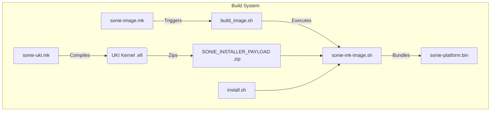
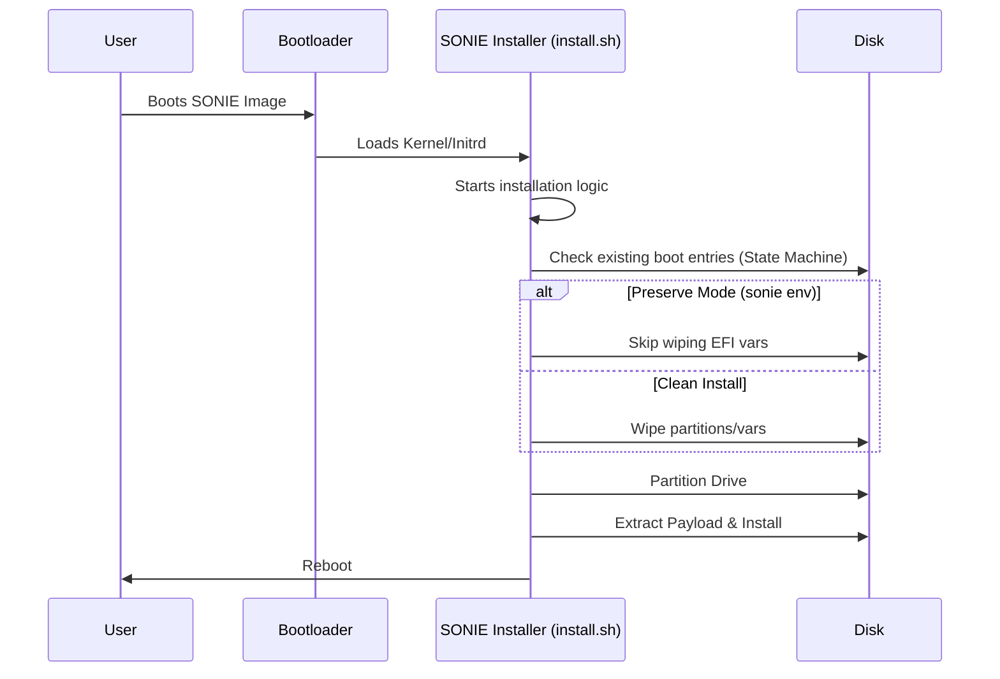
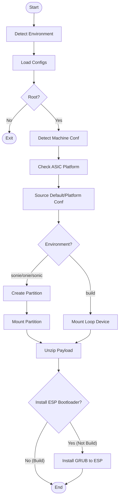
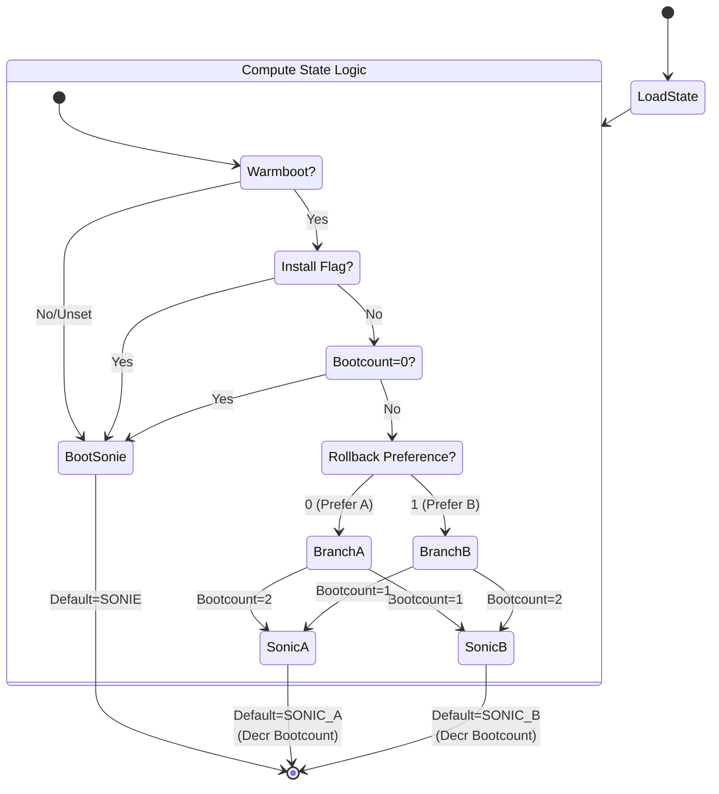
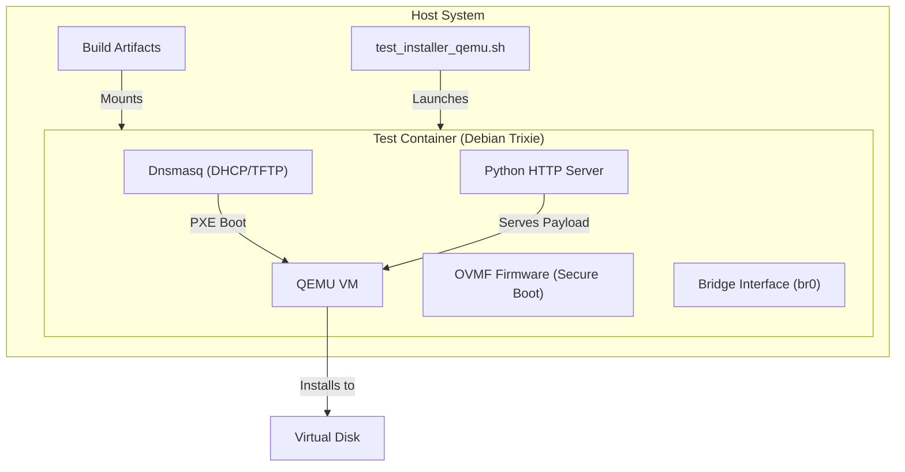
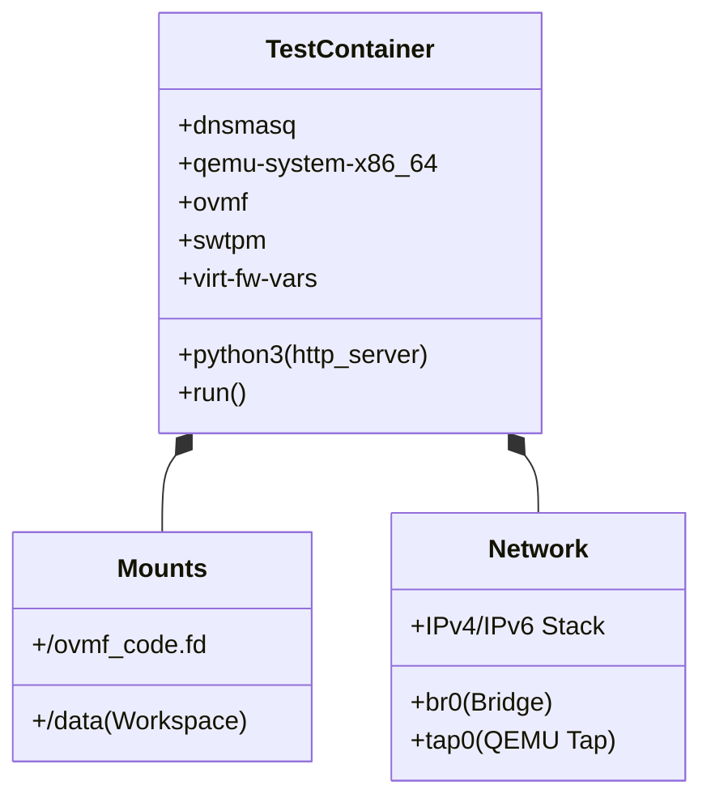
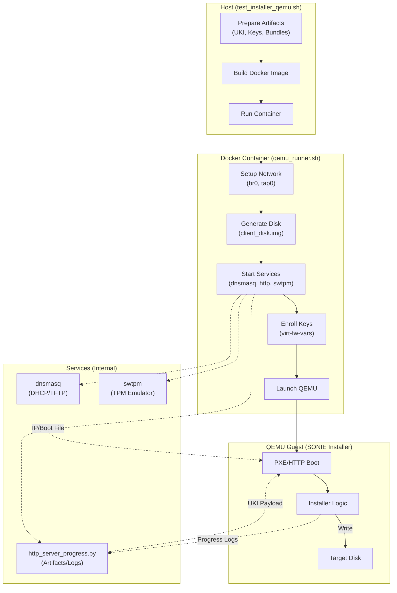

# SONIE Image and Installer HLD

## Table of Content
- [1. HLD Version](#1-hld-version)
- [2. Scope](#2-scope)
- [3. Definitions/Abbreviations](#3-definitionsabbreviations)
- [4. Overview](#4-overview)
- [5. Requirements](#5-requirements)
- [6. Architecture Design](#6-architecture-design)
- [7. High-Level Design](#7-high-level-design)
- [8. SAI API](#8-sai-api)
- [9. Configuration and management](#9-configuration-and-management)
- [10. Warmboot and Fastboot Design Impact](#10-warmboot-and-fastboot-design-impact)
- [11. Memory Consumption](#11-memory-consumption)
- [13. Testing Requirements/Design](#13-testing-requirementsdesign)
- [14. Open/Action items](#14-openaction-items)

| 0.8 | 2026-01-23 | Google | Finalized diagram syntax (flowchart TD, <br/> labels) for broad compatibility. |
| 0.7 | 2026-01-23 | Google | Finalized Mermaid syntax and synchronized with codebase flowchart/labels. |
| 0.6 | 2026-01-23 | Google | Finalized diagram labels for CheckWarmboot flow consistency. |

## 2. Scope
This document describes the design and implementation of the "SONIE" image and installer infrastructure within the SONiC build system. The scope includes the creation of a specialized installer image (`.bin`), the Unified Kernel Image (UKI) support for this installer, and the associated testing infrastructure using QEMU.

## 3. Definitions/Abbreviations
- **UKI**: Unified Kernel Image
- **SONIE**: A specialized SONiC installer/recovery image variant.
- **ONIE**: Open Network Install Environment.
- **QEMU**: Quick Emulator.

## 4. Overview
The SONIE image is a specialized build target designed for testing and recovery scenarios. It leverages the SONiC build system to generate a self-extracting installer image that supports modern boot mechanisms like systemd-boot and UKI. Key goals include providing a robust installer environment, supporting secure upgrades, and enabling efficient testing via QEMU.

## 5. Requirements
- The build system must support generating a `sonie-$(PLATFORM).bin` image.
- The image must use `systemd-boot` and support UKI (.efi) payloads.
- The installer must be capable of preserving existing bootloader states when running in a `sonie` environment.
- The build process must support image signing for secure upgrade workflows.
- A test infrastructure using QEMU must be provided to verify the installation process.
- The image must be smaller than a full SONiC image, containing only essential dockers (Database, Orchagent, Platform Monitor, Syncd Base).

## 6. Architecture Design
The SONIE architecture introduces a new image type (`IMAGE_TYPE=sonie`) and a corresponding installer workflow.

### Build System Integration
- **Makefiles**: New rules `sonie-image.mk` and `sonie-uki.mk` differ from standard SONiC rules by prioritizing UKI generation and packaging it into a ZIP payload for the installer script.
- **Installer Script**: A modified `install.sh` and `sonie-mk-image.sh` handle the creation of the self-extracting archive.
- **Bootloader**: The `bootloader_state_machine.grub` is enhanced to recognize the `sonie` environment and skip aggressive cleanup of other boot entries, facilitating safe recovery/reinstall operations.

### Build Flow Diagram



### 6.3 Partition Layout
The installer uses a specific partition layout to maintain the recovery OS alongside the main OS.
*   **Partition 1 (ESP)**: FAT32, type `EF00`. Stores GRUB bootloader and environment.
*   **SONIE Partition**: FAT32/Ext4, type `EA00` (XBOOTLDR). Stores the SONIE UKI and potentially the main OS images during updates.


## 7. High-Level Design

### 7.1 Build Flow
1.  **UKI Generation**: `sonie-uki.mk` compiles the kernel and initrd into a single `.efi` executable (UKI).
2.  **Payload Packaging**: The UKI is zipped to create `SONIE_INSTALLER_PAYLOAD`.
3.  **Installer Image**: `sonie-image.mk` invokes `build_image.sh` with `IMAGE_TYPE=sonie`.
4.  **Script Bundling**: `sonie-mk-image.sh` bundles the payload and the `install.sh` script into the final `.bin` executable.

### 7.2 Installer Execution Sequence



### 7.3 Installer Logic Flow
The installation process follows a sequential flow: Environment Detection -> Config Loading -> Device Discovery -> Partitioning -> Payload Extraction -> Bootloader Setup.



### 7.4 Data Flow & Dependencies
- **Directory/File Conditions**:
    - `/proc/mounts`: Used to detect RAM root (`rootfs`/`tmpfs`).
    - `/etc/lsb-release`: Checked for `DISTRIB_ID=onie`.
    - `/etc/machine.conf` or `/host/machine.conf`: Platform configuration source.
    - `*.zip`: The installer looks for a zip payload in `SCRIPT_DIR` to extract.
    - `default_platform.conf`: Sourced for platform-specific functions.
    - `bootloader_state_machine.grub`: Sourced and appended to `grub.cfg`.

### 7.5 Bootloader State Machine
The GRUB configuration implements a state machine to manage boot priorities between SONIE (Recovery) and SONiC (A/B slots).



**State Variables (stored in `sonie_env` on ESP):**
- **warmboot_env**: Forces boot to SONIE (Recovery) if unset or 0. Must be 1 to boot SONiC.
- **install_env**: Forces boot to SONIE if set (used during updates).
- **bootcount_env**: 3-state counter (0=Recovery, 1, 2). Decrements on successful boot selection.
- **rollback_env**: Determines preference order (0 = A then B, 1 = B then A).

### 7.6 Modules and Repositories
- **Repositories**: `sonic-buildimage`, `sonic-upstream`.
- **New Directories**:
    - `sonie-installer/`: Contains installer logic and configuration.
    - `sonie-test-trixie/`: QEMU test environment.
- **Modified Scripts**: `build_image.sh`, `slave.mk`, `build_debian.sh`.

### 7.7 Container Payload
The SONIE image includes a reduced set of containers to minimize size while maintaining essential functionality for recovery/testing:
- `DOCKER_DATABASE`
- `DOCKER_ORCHAGENT`
- `DOCKER_PLATFORM_MONITOR`
- `DOCKER_SYNCD_BASE`

### 7.8 Security
- **Secure Boot**: Supported via UKI signing. The build system automatically generates Secure Boot enrollment artifacts (`PK.auth`, `KEK.auth`, `db.auth`) during the UKI assembly phase.
- **Credentials**: No default hardcoded credentials; relies on `USERNAME`/`PASSWORD` build arguments or setup.

### 7.9 Installer Portability and Robustness
The SONiC SONIE installer is designed to be robust and portable across different shell environments and directory structures.

- **Shell Compatibility**: The installer logic in `default_platform.conf` (e.g., `install_grub_to_esp`) has been refactored to avoid Bash-specific features like arrays, ensuring compatibility with the `ash` shell commonly found in minimal recovery environments (initramfs).
- **Relocatable Scripts**: Scripts use a `SCRIPT_DIR` variable (calculated via `dirname "$0"`) to source local configurations (e.g., `platform.conf`), ensuring relative paths work correctly regardless of the current working directory from which the installer is invoked.
- **Cleanup Traps**: The `install_esp_bootloader` function uses a `_trap_push` mechanism to ensure that temporary mount points and directories (like the ESP mount) are safely unmounted and removed even if the script execution is interrupted or fails.
- **Bootloader Backups**: Before overwriting the existing GRUB configuration on the target device, the installer creates a backup (`grub.cfg.bak`). This provides a recovery path if the new configuration is invalid or the installation fails midway.

### 7.10 Documentation and Diagrams
The SONIE documentation uses **Mermaid** for technical diagrams.
- **Flowcharts (`graph TD` / `flowchart TD`)**: Used for sequential logic (e.g., installer flow).
- **State Diagrams (`stateDiagram-v2`)**: Used for the bootloader state machine.
- **Sequence Diagrams**: Used for interaction between user, bootloader, and installer.

Diagrams are verified for syntax compatibility with standard GitHub and VS Code previewers. 

**Syntax Validation Rationale**:
- **Nodes & Labels**: Standard IDs (e.g., `DetectEnv`) with brackets (`[]` for rectangles, `{}` for diamonds) are used for broad compatibility.
- **Line Breaks**: The `\n` sequence is used for multiline labels within brackets (e.g., `LoadConfigs[\"Load Configs\\n(machine.conf, platform.conf)\"]`).
- **Nesting**: Logical grouping is achieved via `subgraph` blocks rather than complex CSS overrides to ensure consistent rendering across different themes.
- **State Logic**: Uses `stateDiagram-v2` with `direction LR` to maintain readability on both mobile and desktop views.

## 8. SAI API
N/A - This feature is a build system and installer enhancement, not a switch functionality change affecting SAI.

## 9. Configuration and management

### 9.1 CLI/YANG
No CLI or YANG changes are introduced by this feature itself. The resulting image runs standard SONiC software.

### 9.2 Build Configuration
- `IMAGE_TYPE=sonie`: Selects the SONIE build target.
- `SONIE_INSTALLER_PAYLOAD`: Path to the UKI payload.
- `SECURE_UPGRADE_MODE`: Enables signing.

#### Build Commands
To build the SONIE image for a specific platform (e.g., `vs`), execute the following commands from the repository root:
```bash
make init
make configure PLATFORM=vs
make target/sonie-vs.bin
```

### 9.3 Installer Files
*   **Input**: `machine.conf`, `platform.conf` (platform configuration).
*   **Output**: `grub.cfg`, `sonie_env` (GRUB environment block).

## 10. Warmboot and Fastboot Design Impact
This feature involves the *installer* and *recovery* image. It does not directly impact the warmboot/fastboot data plane performance of the installed OS, but it provides a mechanism to install an OS that supports these features. The installer itself is designed to be reliable and safe (preserving boot entries).

## 11. Memory Consumption
The SONIE installer runs in a transient environment (initramfs/recovery OS). Its memory footprint is minimized by including only essential components.

## 13. Testing Requirements/Design

### 13.1 QEMU Test Environment
A dedicated test environment (`sonie-test-trixie`) is provided to validate the image.

#### 13.1.1 Test Architecture



#### 13.1.2 Docker Container Design
The test container consolidates all testing dependencies into a single ephemeral environment.



- **PXE Boot**: Validates IPv4 and IPv6 PXE boot paths.
- **Virtual Machine**: Uses QEMU to emulate a SONiC device.
- **Progress Tracking**: Uses `http_server_progress.py` to monitor installation status.

### 13.2 Detailed Testing Workflow
The following diagram illustrates the interaction between the host, the test container, and the guest VM during a test run.



### 13.3 Test Cases
1.  **Build Success**: Verify `make target/sonie-vs.bin` succeeds.
2.  **QEMU Install**: Boot the generated image in QEMU and verify successful installation to disk.
    *   To run the QEMU test, execute the following script from the repository root:
        ```bash
        ./test_installer_qemu.sh --install-disk
        ```
    *   You can also test with IPv4 by adding the `-4` flag, or enable verbose logging with `--log-level verbose`.
3.  **Bootloader Preservation**: Verify that existing ONIE/SONiC boot entries are not wiped during a SONIE install (if configured to preserve).


## 14. Open/Action items
- Refine recovery image build process to ensure all payloads are slimmed and signed.
